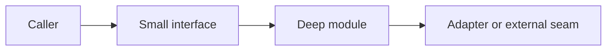

## Problem

What user or engineering problem are we solving?

## Proposed outcome

What should exist when this issue is complete?

## Scope

### In scope

- 

### Out of scope

- 

## Architecture diagram

Use Mermaid. Show the module, interface, seam and adapter affected by this feature.

## Acceptance criteria

- [ ] 
- [ ] 
- [ ] Tests or evidence are attached for every criterion.
- [ ] Recovery impact is documented if firmware or board state changes.

## Test plan

- [ ] Typecheck/build:
- [ ] Unit/native-host tests:
- [ ] SDL/screenshot evidence:
- [ ] ESP-IDF or hardware evidence:

## Dependencies and risks

- 
