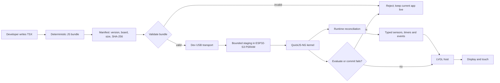

# TSX-LVGL

<p align="center">
  
</p>

<p align="center"><strong>Write typed TSX. See it live on real ESP32 hardware in seconds — no reflash.</strong></p>

<p align="center">
  <a href="https://github.com/Remeic/tsx-lvgl/actions/workflows/ci.yml?query=branch%3Amain"></a>
</p>

TSX-LVGL lets embedded teams author interactive interfaces in TypeScript/TSX,
run them in a small device-owned JavaScript runtime, and render them through
native LVGL on ESP32-class hardware. The application is the reloadable part:
edit a component, push the bundle over USB Serial/JTAG, and the running app is
replaced live — the firmware, kernel and native ABI stay put.

That loop is not aspirational. The Counter golden loop — build a bundle on the
host, push it to a running board, watch the app swap live, drive it with touch
and shake — is closed on the physical Waveshare ESP32-S3-Touch-AMOLED-1.8 V1
(SH8601 display, FT3168 touch, QMI8658 IMU).

```tsx
import { Button, Screen, Text, useState, type VNode } from "@tsx-lvgl/sdk";

export default function Counter(): VNode {
  const [count, setCount] = useState(0);

  return (
    <Screen>
      <Text text={`count=${count}`} />
      <Button
        label="increment"
        onClick={() => setCount((value) => value + 1)}
      />
    </Screen>
  );
}
```

> Status: the M1 runtime slice — typed TSX authoring, deterministic bundles,
> transactional hot reload, motion and Wi-Fi capabilities — is implemented and
> proven end-to-end on the physical target board. Rollback/soak evidence,
> persistent last-known-good storage, authenticated transport and production
> deployment remain explicit, separately gated work.

## Why TSX-LVGL?

Embedded UI work usually forces a choice: hand-maintained widget plumbing in C,
or dragging a browser/React-Native-class stack onto a microcontroller.
TSX-LVGL takes a third path — the composition and type safety of modern UI
authoring, on a runtime small enough to live beside LVGL on an ESP32:

| You need | TSX-LVGL provides |
| --- | --- |
| A maintainable UI authoring model | A deliberately small, typed TSX vocabulary and immutable VNodes |
| Fast feedback on embedded hardware | Seconds-long edit→push→see loop over dev USB Serial/JTAG, no reflash; the same contracts run host-side without a board |
| Hardware-aware application code | Versioned, typed capabilities: motion samples with shake detection, a fenced Wi-Fi station runtime, reload-epoch fencing so stale callbacks can't touch the current app |
| Native embedded behavior | A thin LVGL host and board boundary; UI changes never require generated UI C |
| Safe iteration | Manifest/size/SHA-256 validation, bounded staging, transactional root replacement — a bad bundle is rejected while the previous app stays live |
| Reproducible builds | Stable JavaScript, manifest and kernel artifacts with pinned tooling and an enforced kernel size budget |

## How the runtime works

The application is the reloadable part. The kernel, reconciler, native ABI and
firmware remain fixed until a separate guarded firmware workflow is used.
QuickJS-NG is the first measured engine candidate, not a permanent
engine-selection promise.



At the host/runtime transaction seam, a failed evaluation, mount or native root
replacement restores the previous in-memory root. A rejected bundle does not
advance the generation.

## Write an app

The supported application facade is intentionally small and explicit:
`Screen`, `View`, `Text`, `Button`, plus `useState`, `useEffect`,
`useInterval`, and the typed capability hooks `useMotion` (with `isShake`) and
`useWifi`. Sensor code consumes validated, versioned samples rather than raw
native pointers, so callbacks and samples from an old reload epoch cannot
update the current app. Applications import only `@tsx-lvgl/sdk` — never the
core, runtime, sensors, bundler or device workspaces directly.

Every app bundle must export a default component or VNode. A committed reload
starts a new application state and reload epoch; state migration is not part
of the current contract.

## Consumer application workflow

The supported local distribution boundary is a standard npm-pack artifact. A
machine bootstrap builds one artifact from a framework checkout and installs it
into an application; the application then works without a registry and without
the framework checkout:

```bash
npm run build
npm run pack:sdk -- --out /tmp/tsx-lvgl-sdk
tsx-lvgl create ./my-app --artifact /tmp/tsx-lvgl-sdk/tsx-lvgl-sdk-0.1.0.tgz
cd my-app
<package-manager> run doctor -- --json
<package-manager> run dev
<package-manager> run check
<package-manager> run build
```

When a development runtime is already running on a locally attached board,
one command builds and pushes the app bundle without reflashing firmware:

```bash
<package-manager> run dev -- --device --port /dev/cu.usbmodemXXX --json
<package-manager> run doctor -- --device --port /dev/cu.usbmodemXXX --json
```

`dev --device` uses the TSXB development transport, negotiates one monotonic
generation from the board's `RDY lastGeneration` reply, and makes at most one
retry. The port and negotiated generation stay in memory for that invocation;
they are never written to `tsx-lvgl.json`, the framework lock, or other
portable project files. `doctor --device` only validates local port syntax and
does not open, reset, flash, or otherwise touch a board.

The application commands use the package manager declared in the app's
`package.json`, selected by its lockfile or inherited from the invoking package
manager. The framework checkout commands above remain npm workspace commands.
Yarn support is limited to Yarn Classic v1 because the consumer contract expects
`node_modules`; Yarn Berry/PnP is not supported by this CLI.

The generated `.tsx-lvgl/framework.lock.json` records the framework source SHA,
artifact version, SHA-256 and byte length. `sync` installs that exact artifact;
`update` is the explicit command that repackages a machine-configured source
checkout. `dev` and `build` verify the lock and never upgrade it. A source path
may be supplied through `TSX_LVGL_SOURCE` or the machine-only
`~/.config/tsx-lvgl/config.json`; it is never written to application config.
The generated `AGENTS.md` records the same ownership and safety rules.

The CLI emits stable diagnostic codes and supports JSON output on all commands
that produce a result. The public `@tsx-lvgl/sdk` package and its `tsx-lvgl`
binary are private and protected from accidental publication; the package
source seam can later be replaced by an npm-compatible registry without
changing application imports or commands.

## Framework development workflow

### 1. Run the host gates

The reproducible path uses the pinned development container and Docker Desktop:

```bash
./tools/dev test
./tools/dev mutation
```

For a fast host-only iteration when Node.js 24.19.0 and npm 11.17.0 are already
installed:

```bash
npm ci
npm run typecheck
npm test
```

The host runner exercises the same bundle, runtime and host contracts without
requiring a board:

```bash
./tools/run-host --entry tests/fixtures/shakeface-a.tsx --shake
```

### 2. Build and try a bundle

Build a new generation of an app bundle:

```bash
node scripts/bundle-app.mjs \
  --entry tests/fixtures/shakeface-a.tsx \
  --out build/bundles \
  --bundle-id shakeface \
  --generation 2
```

If a development probe is already running and its serial port is available,
push that bundle without reflashing:

```bash
./tools/push-bundle --port /dev/cu.usbmodemXXX \
  --bundle build/bundles/shakeface.g2.js \
  --manifest build/bundles/shakeface.g2.manifest.json
```

The generation must be greater than the currently running generation; replace
`2` with the next unused generation when repeating the workflow. This command
is a bundle push, not an installer: it assumes a running probe and a host-side
serial bridge. Docker Desktop for Mac does not provide USB passthrough by
itself; see [the development environment guide](docs/development-environment.md)
and [the recovery protocol](docs/recovery.md) before attempting physical-board
work.

The transport is development-only, integrity-checked and unauthenticated. It
uses RAM/PSRAM staging, never writes flash and must not be treated as a secure
OTA or production update channel.

App-only changes use this bundle path. Changes to the kernel, native bindings,
board host or baked-in application require regenerating the embedded artifacts
and rebuilding firmware; see the
[runtime-port probe guide](examples/esp-idf/runtime_port_probe/README.md).

### 3. Build the runtime-port probe

The committed runtime-port probe is the development runtime host for the
target board: it boots the embedded kernel, mounts the baked-in Counter app,
and then accepts hot-reloaded bundles over the dev transport. Build it with
the pinned toolchain:

```bash
./tools/dev qemu \
  "cd examples/esp-idf/runtime_port_probe && idf.py build"
```

Do not flash directly. Flashing only happens through the guarded board
workflow after the recovery and identity gates in
[the recovery protocol](docs/recovery.md) pass.

## What is supported today

- `Screen`, `View`, `Text` and `Button` with typed props;
- immutable VNodes and keyed reconciliation;
- `useState`, effects, deterministic intervals and event replacement;
- versioned typed sensor schemas, validation and stale-epoch fencing;
- a motion capability with on-board IMU sampling and `isShake` detection;
- a fenced Wi-Fi station capability (`useWifi`) with typed scan and link state;
- deterministic TSX-to-JavaScript bundling with a manifest and SHA-256;
- a board-host composition using QuickJS-NG (the first measured engine
  candidate) with a thin native LVGL host and an enforced kernel size budget;
- a transactional reload seam and dev-only bounded USB transport, closed
  end-to-end on the physical ESP32-S3 board (boot, display, touch, motion,
  live app push);
- a portable consumer SDK/CLI with device-backed dev mode;
- host tests, mutation gates, deterministic artifact checks and an ESP-IDF
  build path.

## Honest boundaries

TSX-LVGL is not React, is not affiliated with React or Meta, and does not claim
to run arbitrary React applications. The supported UI model is deliberately
smaller than browser React: DOM, CSS, Suspense, browser APIs and an unrestricted
native-widget escape hatch are outside the current contract.

The repository is an npm workspace, but the current bundler does not resolve
and include arbitrary `node_modules` packages in the app bundle. Pure
JavaScript dependency bundling is a planned capability; packages that require
Node.js, the DOM, filesystem access, network APIs or native addons will also
need an explicit device adapter.

State migration across reloads, authenticated transport, persistent
last-known-good storage, OTA and production deployment are separate gates.

Host reconciliation, firmware builds, QEMU and physical-board behavior are
different kinds of evidence, and this repository keeps them distinct: the
golden loop has been closed on the physical board, but board captures are
transient evidence, and rollback/soak evidence remains a separate gate. The
transient FT3168/I2C warm-reset issue remains open; see the
[diagnosis note](docs/diagnostics/ft3168-i2c-reset.md).

## Project shape

```text
packages/sdk           stable application facade, CLI and consumer contract
packages/core          immutable VNodes and the internal TSX vocabulary
packages/runtime       reconciliation, hooks, engine seam and reload transaction
packages/capabilities  capability binding, observation and state contracts
packages/sensors       versioned typed sensor schemas and samples
packages/connectivity  typed Wi-Fi station controller and link contracts
packages/bundler       deterministic TSX-to-JS bundles, manifests and transport
packages/device        QuickJS/LVGL kernel composition and native host boundary
examples/apps          hello-screen, counter and sensor-readout examples
examples/esp-idf       ESP-IDF runtime-port probe and embedded kernel artifacts
tests/fixtures         internal end-to-end hot-reload fixtures
docs/                  architecture, feature contracts, development and recovery
```

Read [the runtime architecture](docs/architecture.md), [Feature 0010](docs/feature-specs/0010-runtime-tsx-hot-reload.md) and [the development environment guide](docs/development-environment.md) before extending the public contract.

## License

Project-owned code is MIT licensed. Third-party code and notices remain under
their original licenses.
