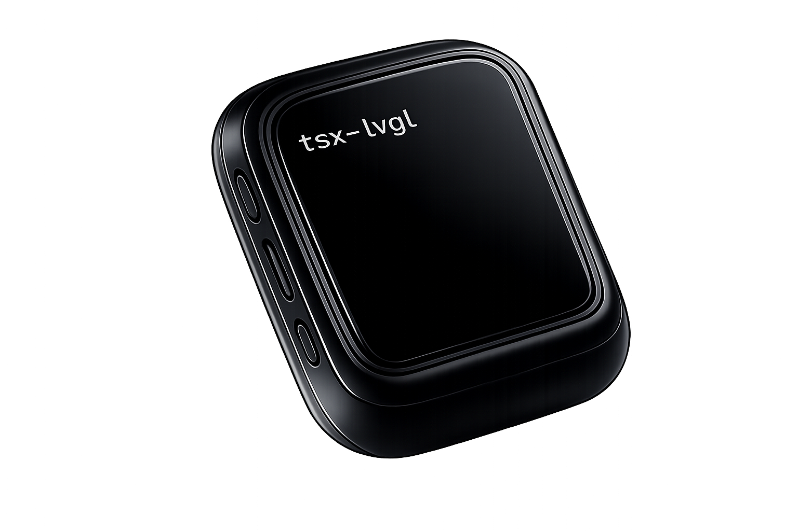
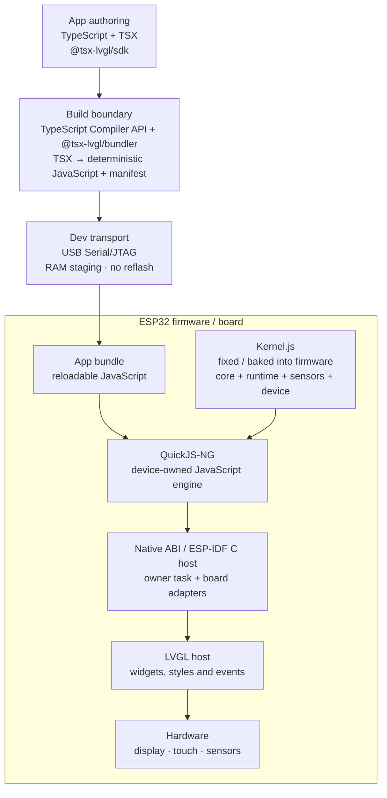

# TSX-LVGL

<p align="center">
  
</p>

<p align="center"><strong>Write typed TSX. See it live on real ESP32 hardware in seconds — no reflash.</strong></p>

<p align="center">
  <a href="https://github.com/Remeic/tsx-lvgl/actions/workflows/ci.yml?query=branch%3Amain"></a>
  <a href="LICENSE"></a>
  <a href="CONTRIBUTING.md"></a>
</p>

<p align="center">
  <a href="#quickstart">Quickstart</a> ·
  <a href="#how-it-works">How it works</a> ·
  <a href="#roadmap">Roadmap</a> ·
  <a href="docs/architecture.md">Architecture</a> ·
  <a href="CONTRIBUTING.md">Contributing</a>
</p>

TSX-LVGL brings the modern UI development loop to microcontrollers. Author
interfaces in TypeScript/TSX, run them in a small device-owned JavaScript
runtime, and render through native LVGL on ESP32-class hardware. The app is
the reloadable part: edit a component, push the bundle over USB, and the
running app swaps live — firmware, kernel and native ABI stay put.

```tsx
import { Button, Screen, Text, useState, type VNode } from "@tsx-lvgl/sdk";

export default function Counter(): VNode {
  const [count, setCount] = useState(0);

  return (
    <Screen>
      <Text text={`count=${count}`} />
      <Button label="increment" onClick={() => setCount((v) => v + 1)} />
    </Screen>
  );
}
```

<!-- TODO: board capture GIF of the live-reload loop goes here -->

This loop is not aspirational: the runtime-probe golden loop — build on the
host, push over USB Serial/JTAG, watch the app swap live, drive it with touch
and shake — is closed on the physical Waveshare ESP32-S3-Touch-AMOLED-1.8 V1
(SH8601 display, FT3168 touch, QMI8658 IMU). The persistent board example is
Pomodoro; Counter remains a compact host and hot-reload fixture.

## Why TSX-LVGL?

Embedded UI work usually forces a choice: hand-maintained widget plumbing in
C, or dragging a browser-class stack onto a microcontroller. TSX-LVGL takes a
third path — a runtime small enough to live beside LVGL on an ESP32:

- **Typed TSX, not widget plumbing** — a deliberately small component
  vocabulary (`Screen`, `View`, `Text`, `Button`) with immutable VNodes,
  typed style props, keyed reconciliation and `useState`/`useEffect`/`useInterval`.
- **Seconds, not reflash cycles** — deterministic bundles hot-pushed over a
  dev USB transport; the same contracts run host-side without a board.
- **Hardware as typed capabilities** — `useMotion`, configurable `useShake`,
  and a fenced Wi-Fi station via `useWifi`; validated, versioned samples with
  reload-epoch fencing so stale callbacks can't touch the current app.
- **Safe by construction** — manifest/size/SHA-256 validation, bounded PSRAM
  staging, transactional root replacement: a bad bundle is rejected while the
  previous app stays live.
- **Reproducible** — pinned toolchain, deterministic JS/manifest/kernel
  artifacts, an enforced kernel size budget, 100% mutation-score gate.

## Quickstart

Install the public SDK/CLI, then create an app:

```bash
npm install --global @tsx-lvgl/sdk
tsx-lvgl create ./my-app
cd my-app && npm run dev
```

Framework contributors can use the equivalent offline artifact workflow:

```bash
npm run pack:sdk -- --out /tmp/tsx-lvgl-sdk
tsx-lvgl create ./my-app --artifact /tmp/tsx-lvgl-sdk/tsx-lvgl-sdk-0.1.0.tgz
```

With a development runtime already running on an attached board, keep this
command running. It pushes the initial bundle and then reloads the configured
app entry after each accepted save, without reflashing:

```bash
npm run dev -- --device --port /dev/cu.usbmodemXXX
```

Full details (package managers, framework lock, diagnostics): see
[the consumer workflow guide](docs/consumer-workflow.md). Hacking on the
framework itself: see [the framework workflow](docs/framework-workflow.md).

## How it works

The compiler boundary produces JavaScript, not UI C: the TypeScript Compiler
API is used by the bundler to turn TSX into a deterministic app bundle. The
historical generated-C compiler/emitter is not part of the active product path.
QuickJS-NG is the first measured engine candidate, not a permanent
engine-selection promise.



A failed evaluation, mount or native root replacement restores the previous
in-memory root; a rejected bundle does not advance the generation. In short:
QuickJS-NG executes both the fixed kernel and the reloadable app, while the
kernel reaches hardware through the native ABI and LVGL host. Deep dive:
[runtime architecture](docs/architecture.md) and
[Feature 0010](docs/feature-specs/0010-runtime-tsx-hot-reload.md).

## Roadmap

Done and proven:

- [x] Typed TSX facade with immutable VNodes and keyed reconciliation
- [x] Typed widget styling and configurable shake detection
- [x] Deterministic bundles with manifest + SHA-256
- [x] Transactional hot reload (host-tested and closed on the physical board)
- [x] Motion capability with on-board IMU sampling and shake detection
- [x] Fenced Wi-Fi station capability with typed scan and link state
- [x] Portable consumer SDK/CLI with device-backed dev mode
- [x] Physical golden loop: boot, display, touch, motion, live app push

Next, each an explicit gate with its own evidence:

- [ ] Rollback and soak evidence on hardware
- [ ] Persistent last-known-good storage
- [ ] FT3168/I2C warm-reset fix ([diagnosis](docs/diagnostics/ft3168-i2c-reset.md))
- [ ] Pure-JavaScript dependency bundling into app bundles
- [ ] Wider widget vocabulary
- [ ] State migration across reloads
- [ ] Authenticated transport / OTA (the dev transport is integrity-checked
      but unauthenticated, and is not a production update channel)

## Honest boundaries

TSX-LVGL is not React, is not affiliated with React or Meta, and does not run
arbitrary React applications: DOM, CSS, Suspense, browser APIs and an
unrestricted native-widget escape hatch are outside the current contract. The
bundler does not yet include arbitrary `node_modules` packages. Host tests,
firmware builds, QEMU and physical-board captures are different kinds of
evidence, and the project keeps them distinct — a passing host test never
claims board readiness.

## Project structure

```text
packages/sdk           stable application facade, CLI and consumer contract
packages/core          immutable VNodes and the internal TSX vocabulary
packages/runtime       reconciliation, hooks, engine seam and reload transaction
packages/capabilities  capability binding, observation and state contracts
packages/sensors       versioned typed sensor schemas and samples
packages/connectivity  typed Wi-Fi station controller and link contracts
packages/bundler       deterministic TSX-to-JS bundles, manifests and transport
packages/device        QuickJS/LVGL kernel composition and native host boundary
examples/apps          hello-screen, counter and sensor-readout examples
examples/esp-idf       ESP-IDF runtime-port probe and embedded kernel artifacts
docs/                  architecture, feature contracts, workflows and recovery
```

## Contributing

The project runs issue-first: a feature starts as a GitHub issue with
acceptance criteria, and the PR closes it with evidence. Start with
[CONTRIBUTING.md](CONTRIBUTING.md), then:

```bash
./tools/dev test       # pinned container: full test gate
./tools/dev mutation   # 100% mutation score, zero survivors
```

Good first stops: [the development environment](docs/development-environment.md),
[the layered testing strategy](docs/feature-specs/0002-testing-and-mutation-strategy.md)
and the [open issues](https://github.com/Remeic/tsx-lvgl/issues).

## License

Project-owned code is [MIT](LICENSE) licensed. Third-party code and notices
remain under their original licenses.
