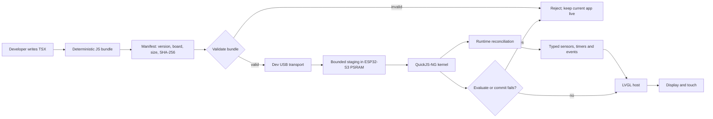

# TSX-LVGL

<p align="center">
  
</p>

<p align="center"><strong>Build typed TSX interfaces for small LVGL devices.</strong></p>

<p align="center">
  <a href="https://github.com/Remeic/tsx-lvgl/actions/workflows/ci.yml?query=branch%3Amain"></a>
</p>

TSX-LVGL lets embedded teams author interactive interfaces in TypeScript/TSX,
run them in a small device-owned JavaScript runtime, and render them through
native LVGL on ESP32-class hardware.

The result is a focused development loop for constrained displays:

- write a typed component instead of hand-maintaining widget plumbing;
- keep hardware access behind versioned, typed capabilities;
- validate changes on the host and use a dev-only bundle path designed to try
  app changes without reflashing firmware once the board gate is available;
- reject a bad bundle or roll it back while the previous in-memory app stays
  live.

The first hardware target is the Waveshare ESP32-S3-Touch-AMOLED-1.8 V1
(SH8601 display and FT3168 touch).

> Status: M1 tracer bullet. The host/runtime contracts and the ESP32-S3 probe
> are implemented; physical-board application reload, complete display/touch
> behavior and recovery remain separate acceptance gates.

## Why use TSX-LVGL?

TSX-LVGL is for developers who want the composition and type safety of modern
UI authoring without bringing a browser or a general-purpose React stack onto
a microcontroller.

| You need | TSX-LVGL provides |
| --- | --- |
| A maintainable UI authoring model | A deliberately small, typed TSX vocabulary and immutable VNodes |
| Fast feedback on embedded hardware | Deterministic app bundles and a dev-only USB Serial/JTAG reload path; host smoke proves the workflow without a board |
| Hardware-aware application code | Versioned sensor schemas, validated samples and reload-epoch fencing |
| Native embedded behavior | A thin LVGL host and board boundary; UI changes do not require generated UI C |
| Safe iteration | Bounded staging, manifest/size validation, transport integrity checks and transactional root replacement |
| Reproducible builds | Stable JavaScript, manifest and kernel artifacts with pinned tooling |

## How the runtime works

The application is the reloadable part. The kernel, reconciler, native ABI and
firmware remain fixed until a separate guarded firmware workflow is used.
QuickJS-NG is the first measured engine candidate in the current probe, not a
permanent engine-selection promise.



At the host/runtime transaction seam, a failed evaluation, mount or native root
replacement restores the previous in-memory root. A rejected bundle does not
advance the generation. Transport timeout behavior, physical-board reload and
persistent last-known-good storage remain explicit gates rather than claims of
the M1 host evidence.

## Write an app

The supported application facade is intentionally small and explicit:

```tsx
import { Button, Screen, Text, useState, type VNode } from "@tsx-lvgl/sdk";

export default function Counter(): VNode {
  const [count, setCount] = useState(0);

  return (
    <Screen>
      <Text text={`count=${count}`} />
      <Button
        label="increment"
        onClick={() => setCount((value) => value + 1)}
      />
    </Screen>
  );
}
```

The facade also exposes `useEffect`, `useInterval`, `useMotion` and the small
typed UI vocabulary. Sensor code consumes validated samples rather than a raw
native pointer, so stale callbacks and samples from an old reload epoch cannot
update the current app. Applications do not import the core, runtime, sensors,
bundler or device workspaces directly.

Every app bundle must export a default component or VNode. A committed M1
reload starts a new application state and reload epoch; state migration is not
part of the current contract.

## Consumer application workflow

The supported local distribution boundary is a standard npm-pack artifact. A
machine bootstrap builds one artifact from a framework checkout and installs it
into an application; the application then works without a registry and without
the framework checkout:

```bash
npm run build
npm run pack:sdk -- --out /tmp/tsx-lvgl-sdk
tsx-lvgl create ./my-app --artifact /tmp/tsx-lvgl-sdk/tsx-lvgl-sdk-0.1.0.tgz
cd my-app
npm run doctor -- --json
npm run dev
npm run check
npm run build
```

The generated `.tsx-lvgl/framework.lock.json` records the framework source SHA,
artifact version, SHA-256 and byte length. `sync` installs that exact artifact;
`update` is the explicit command that repackages a machine-configured source
checkout. `dev` and `build` verify the lock and never upgrade it. A source path
may be supplied through `TSX_LVGL_SOURCE` or the machine-only
`~/.config/tsx-lvgl/config.json`; it is never written to application config.
The generated `AGENTS.md` records the same ownership and safety rules.

The CLI emits stable diagnostic codes and supports JSON output on all commands
that produce a result. The public `@tsx-lvgl/sdk` package and its `tsx-lvgl`
binary are private and protected from accidental publication; the package
source seam can later be replaced by an npm-compatible registry without
changing application imports or commands.

## Framework development workflow

### 1. Run the host gates

The reproducible path uses the pinned development container and Docker Desktop:

```bash
./tools/dev test
./tools/dev mutation
```

For a fast host-only iteration when Node.js 24.19.0 and npm 11.17.0 are already
installed:

```bash
npm ci
npm run typecheck
npm test
```

The host runner exercises the same bundle, runtime and host contracts without
requiring a board:

```bash
./tools/run-host --entry tests/fixtures/shakeface-a.tsx --shake
```

### 2. Build and try a bundle

Build a new generation of an app bundle:

```bash
node scripts/bundle-app.mjs \
  --entry tests/fixtures/shakeface-a.tsx \
  --out build/bundles \
  --bundle-id shakeface \
  --generation 2
```

If a guarded development probe is already running and its serial port is
available, push that bundle without reflashing:

```bash
./tools/push-bundle --port /dev/cu.usbmodemXXX \
  --bundle build/bundles/shakeface.g2.js \
  --manifest build/bundles/shakeface.g2.manifest.json
```

The generation must be greater than the currently running generation; replace
`2` with the next unused generation when repeating the workflow. This command
is a bundle push, not an installer: it assumes a running probe and a host-side
serial bridge. Docker Desktop for Mac does not provide USB passthrough by
itself; see [the development environment guide](docs/development-environment.md)
and [the recovery protocol](docs/recovery.md) before attempting physical-board
work.

The transport is development-only, integrity-checked and unauthenticated. It
uses RAM/PSRAM staging, never writes flash and must not be treated as a secure
OTA or production update channel.

App-only changes use this bundle path. Changes to the kernel, native bindings,
board host or baked-in application require regenerating the embedded artifacts
and rebuilding firmware; see the
[runtime-port probe guide](examples/esp-idf/runtime_port_probe/README.md).

### 3. Build the runtime-port probe

The committed runtime-port probe is a feasibility harness for the target board.
Build it with the pinned toolchain:

```bash
./tools/dev qemu \
  "cd examples/esp-idf/runtime_port_probe && idf.py build"
```

This validates the ESP-IDF composition and build path; it does not prove
physical display, touch, reset or app-reload behavior. Do not flash directly.
Physical-board work is gated by the recovery, identity and app-only workflow in
[the recovery protocol](docs/recovery.md).

## What is supported today

The current M1 runtime slice includes:

- `Screen`, `View`, `Text` and `Button` with typed props;
- immutable VNodes and keyed reconciliation;
- `useState`, effects, deterministic intervals and event replacement;
- versioned typed sensor schemas, validation and stale-epoch fencing;
- deterministic TSX-to-JavaScript bundling with a manifest and SHA-256;
- a board-host composition using QuickJS-NG, currently the first measured
  engine candidate, with a thin native LVGL host;
- a host-tested transactional reload seam plus a dev-only bounded transport and
  ESP32-S3 probe path; physical-board application reload is a later acceptance
  gate;
- host tests, mutation gates, deterministic artifact checks and an ESP-IDF
  build path.

## Honest boundaries

TSX-LVGL is not React, is not affiliated with React or Meta, and does not claim
to run arbitrary React applications. The supported UI model is deliberately
smaller than browser React: DOM, CSS, Suspense, browser APIs and an unrestricted
native-widget escape hatch are outside the current contract.

The repository is an npm workspace, but application-side npm availability is
not yet the same as on-device npm support. The current M1 bundler does not
resolve and include arbitrary `node_modules` packages in the app bundle. Pure
JavaScript dependency bundling is a planned capability; packages that require
Node.js, the DOM, filesystem access, network APIs or native addons will also
need an explicit device adapter.

State migration across reloads, authenticated transport, persistent
last-known-good storage, OTA and production deployment are separate gates.

## Evidence boundaries

Host reconciliation, QuickJS-NG feasibility, simulator behavior, ESP-IDF
builds, QEMU, physical display/touch behavior and recovery are different kinds
of evidence. A passing host test or firmware build does not prove physical
board readiness.

The transient FT3168/I2C warm-reset issue remains open; see the
[diagnosis note](docs/diagnostics/ft3168-i2c-reset.md) for the current status
and required evidence.

## Project shape

```text
packages/sdk        stable application facade, CLI and consumer contract
packages/core       immutable VNodes and the internal TSX vocabulary
packages/runtime    reconciliation, hooks, engine seam and reload transaction
packages/sensors    versioned typed capabilities and samples
packages/bundler    deterministic TSX-to-JS bundles, manifests and transport
packages/device     QuickJS/LVGL kernel composition and native host boundary
examples/apps       tiny hello-screen, counter and sensor-readout examples
tests/fixtures       internal end-to-end hot-reload fixture (not a framework example)
examples/esp-idf    ESP-IDF runtime-port probe and embedded kernel artifacts
docs/                architecture, feature contracts, development and recovery
```

Read [the runtime architecture](docs/architecture.md), [Feature 0010](docs/feature-specs/0010-runtime-tsx-hot-reload.md) and [the development environment guide](docs/development-environment.md) before extending the public contract.

## License

Project-owned code is MIT licensed. Third-party code and notices remain under
their original licenses.
