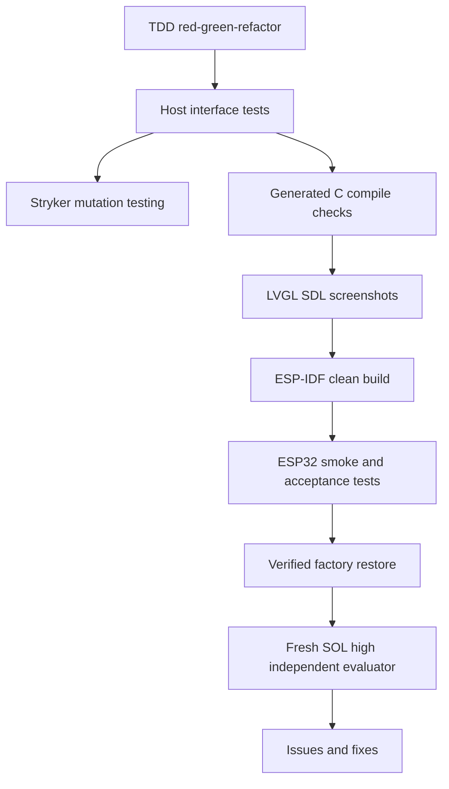

# Feature 0002 — layered testing and independent evaluation

## Problem

The project has two very different failure domains: host-side compiler logic and hardware-dependent ESP32 behavior. A single test style cannot provide trustworthy coverage for both.

## Proposed outcome

Establish a test pyramid that catches compiler and runtime regressions quickly, exercises generated LVGL output, records board-level evidence, and runs a fresh independent evaluation before declaring a milestone complete.

## Architecture

## Test layers

| Layer | What it proves | Cadence |
| --- | --- | --- |
| TypeScript public-interface tests | Core and compiler behavior through public seams | Every change |
| Property/golden tests | IR and generated output invariants | Every compiler feature |
| Stryker mutation tests | Tests detect realistic changes in core/compiler/emitter/react | Every milestone; PR on scoped changes when fast |
| Generated C compile | Emitter output is syntactically and API compatible | Every emitter change |
| LVGL SDL screenshots | Layout and visual behavior without hardware | Every visual change |
| ESP-IDF build matrix | Board adapter and generated artifact integrate cleanly | Every board/runtime change |
| Guarded board-reload plan tests | App-only offset, identity preflight and forbidden-operation policy | Every reload-policy change |
| ESP32 Unity/serial smoke | Real boot, touch, display, timing and memory behavior | Hardware milestone |
| Recovery validation | Same-board factory restore remains possible | Before and after risky flash work |
| Independent evaluator | Fresh architecture, testing, safety and maintainability review | Before milestone release |

## Mutation policy

Stryker mutates `packages/core`, `packages/compiler`, `packages/lvgl-emitter`
and `packages/react`, where behavior is deterministic and tests can kill
mutants quickly. We do not mutate vendor drivers, generated C, hardware timing
or the physical board: those require compile, simulator, serial and hardware
evidence instead.

The first configuration uses Stryker's command runner because the repository currently uses Node's built-in test runner. The `mutation` script prebuilds workspace declarations before Stryker initializes its TypeScript checker; its sandbox then runs a lockfile installation before building so workspace package links resolve inside the mutated copy. If test volume makes this slow, migrate the host runner to a Stryker-supported integrated runner (for example Vitest) as a separately documented feature; do not hide a slow mutation run behind a fake coverage number.

The 100% / 315-mutant result is a pre-MVP historical baseline. The React
source-entry slice expands the deterministic parser, compatibility-surface and
native-emitter behavior substantially. `./tools/dev mutation` runs two
independent blocking configurations so the legacy baseline cannot dilute the
MVP score: `mutation:legacy` covers `packages/core/src/**/*.ts` and the legacy
`packages/lvgl-emitter/src/**/*.ts`; it preserves the origin/main policy of
high/low/break 100 and concurrency 1. `mutation:mvp` covers
`packages/compiler/src/**/*.ts` and `packages/react/src/**/*.ts`, with its
independent high/low/break 80/70/80 policy and concurrency 4. CI uploads both
SHA-bound report directories under `reports/mutation/`.

A retained/reference run under Node 24.19.0 (historical context, not a
current-HEAD claim) classified the mutants as follows and reported no
timeouts:

- Legacy: 321 instrumented, 240 killed, 0 survived, 80 `CompileError`, 1
  ignored, reported effective score 100.00% (`240 / (240 + 0)`).
- MVP: 1,190 instrumented, 644 killed, 39 survived, 507 `CompileError`, 0
  ignored, reported effective score 94.29% (`644 / (644 + 39)`).

The killed/`CompileError`/survivor classification can vary between otherwise
equivalent runs because of TypeScript checker timing; counts and scores are
not invariant. These prose values are reference context only and must not be
copied forward as current evidence after a source or documentation change.
For each reviewed SHA, the JSON reports in
`reports/mutation/{legacy,mvp}/mutation.json`, together with the CI artifact
`mutation-report-${GITHUB_SHA}` that contains them, are authoritative. The
artifact SHA and the checked-out commit must be matched before recording a
result.

Survivor dispositions are recorded rather than hidden behind a per-file
counter. The compiler-private native emitter and React JSX runtime have zero
survivors; event filtering, C0 escaping, and null/undefined/false child
handling are behavior-tested. The remaining compiler `index.ts` survivors are
the deterministic-failure guard and its diagnostic text, which require an
injected nondeterministic compiler to observe. The remaining `source.ts`
survivors are diagnostic wording, defensive AST/parser branches, and identity
sanitization branches outside the accepted TSX shapes; accepted syntax,
diagnostics, bounds, identity, and deterministic output are covered by direct
tests. The two React `index.ts` survivors are the compiler-only `useState`
error wording and a redundant non-null guard after the caller has already
filtered nullish values. These are retained as nonblocking hardening follow-up
items and remain visible in the JSON report. This is host evidence only, not
hardware confidence.

## Acceptance criteria

- [ ] Public interfaces and test seams are documented before each new test slice.
- [x] Stryker runs against only deterministic core/compiler/emitter/react source.
- [ ] TypeScript checker rejects mutants that cannot compile.
- [x] Mutation report is reproducible with the lockfile and Node 24.19.0.
- [x] The final mutation scores and survivor dispositions are recorded in the SHA-bound evidence.
- [x] Generated C has a host compile check before hardware flashing.
- [ ] SDL visual evidence is attached for visual UI features.
- [ ] ESP-IDF Unity/serial tests cover board integration at the hardware milestone.
- [x] The guarded app-only reload plan is tested without executing hardware commands.
- [ ] Recovery evidence is recorded after the first custom flash.
- [ ] A fresh SOL high evaluator reviews the completed milestone in a separate thread.
- [ ] Findings become GitHub issues or linked fixes; no finding is silently dismissed.

## Evaluator protocol

At the end of a milestone, create a separate evaluator thread using the SOL model at high reasoning. Give it the repository state, issue/AC links and test evidence, and explicitly ask it to review without implementing first. After the report, address each accepted finding in a scoped issue/commit and rerun the full test matrix.
