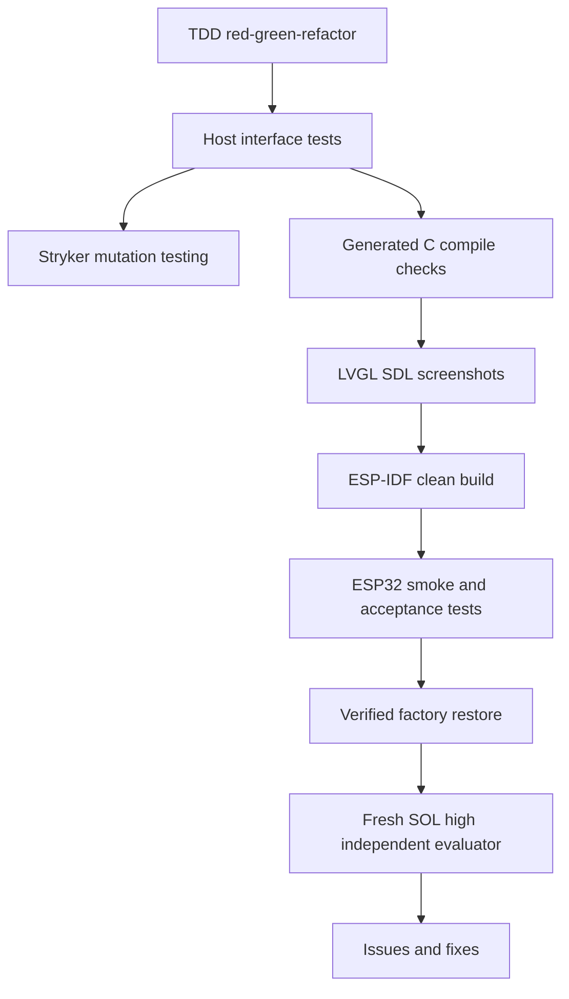

# Feature 0002 — layered testing and independent evaluation

## Problem

The project has two very different failure domains: host-side compiler logic and hardware-dependent ESP32 behavior. A single test style cannot provide trustworthy coverage for both.

## Proposed outcome

Establish a test pyramid that catches compiler and runtime regressions quickly, exercises generated LVGL output, records board-level evidence, and runs a fresh independent evaluation before declaring a milestone complete.

## Architecture

## Test layers

| Layer | What it proves | Cadence |
| --- | --- | --- |
| TypeScript public-interface tests | Core and compiler behavior through public seams | Every change |
| Property/golden tests | IR and generated output invariants | Every compiler feature |
| Stryker mutation tests | Tests detect realistic changes in core/compiler/emitter | Every milestone; PR on scoped changes when fast |
| Generated C compile | Emitter output is syntactically and API compatible | Every emitter change |
| LVGL SDL screenshots | Layout and visual behavior without hardware | Every visual change |
| ESP-IDF build matrix | Board adapter and generated artifact integrate cleanly | Every board/runtime change |
| ESP32 Unity/serial smoke | Real boot, touch, display, timing and memory behavior | Hardware milestone |
| Recovery validation | Same-board factory restore remains possible | Before and after risky flash work |
| Independent evaluator | Fresh architecture, testing, safety and maintainability review | Before milestone release |

## Mutation policy

Stryker mutates `packages/core`, `packages/compiler` and `packages/lvgl-emitter`, where behavior is deterministic and tests can kill mutants quickly. We do not mutate vendor drivers, generated C, hardware timing or the physical board: those require compile, simulator, serial and hardware evidence instead.

The first configuration uses Stryker's command runner because the repository currently uses Node's built-in test runner. The `mutation` script prebuilds workspace declarations before Stryker initializes its TypeScript checker; its sandbox then runs a lockfile installation before building so workspace package links resolve inside the mutated copy. If test volume makes this slow, migrate the host runner to a Stryker-supported integrated runner (for example Vitest) as a separately documented feature; do not hide a slow mutation run behind a fake coverage number.

Mutation results are evidence for one exact commit SHA, lockfile, Node version, operating system and Stryker/toolchain invocation. Do not claim a repository-wide or current 100% baseline in this document until the JSON report for that exact SHA has been retained and the killed, CompileError, survivor and timeout classifications have been reviewed. TypeScript diagnostic classification can vary by platform and tool-process timing, so the report—not prose—is the source of truth while that classification is being stabilized. The configured break threshold is 100%, therefore a survivor or timeout cannot produce a green mutation run. This remains evidence only for the deterministic host slice, not hardware confidence.

## Acceptance criteria

- [x] Public interfaces and test seams are documented for the current host compiler slice.
- [x] Stryker runs against only deterministic core/compiler/emitter source.
- [ ] TypeScript checker rejects mutants that cannot compile.
- [ ] Mutation report is reproducible with the lockfile and Node 24.19.0.
- [ ] The baseline mutation score is recorded with surviving mutants triaged.
- [x] Generated C has a host compile check before hardware flashing.
- [ ] SDL visual evidence is attached for visual UI features.
- [ ] ESP-IDF Unity/serial tests cover board integration at the hardware milestone.
- [ ] Recovery evidence is recorded after the first custom flash.
- [ ] A fresh SOL high evaluator reviews the completed milestone in a separate thread.
- [ ] Findings become GitHub issues or linked fixes; no finding is silently dismissed.

## Evaluator protocol

At the end of a milestone, create a separate evaluator thread using the SOL model at high reasoning. Give it the repository state, issue/AC links and test evidence, and explicitly ask it to review without implementing first. After the report, address each accepted finding in a scoped issue/commit and rerun the full test matrix.
