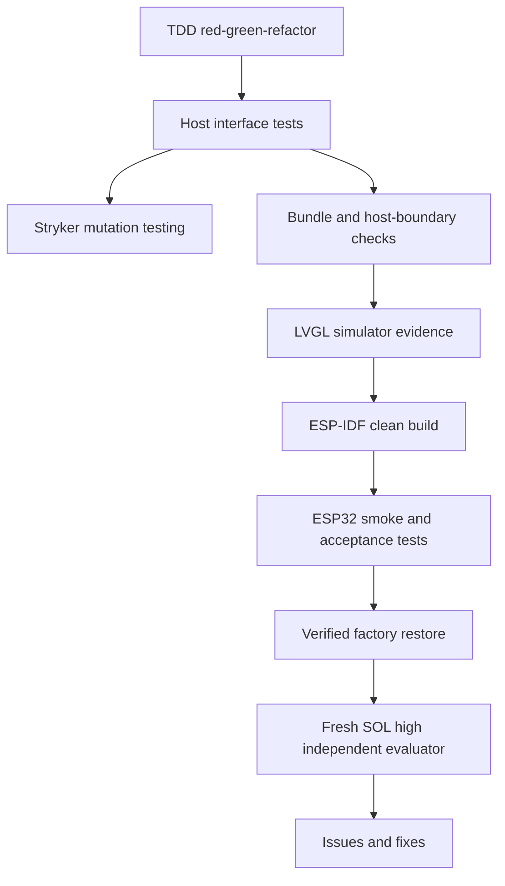

# Feature 0002 — layered runtime testing and independent evaluation

> The original compiler/generated-C plan is superseded by Feature 0010. This
> document retains the evidence discipline and now names the runtime slice.

## Problem

The project has two very different failure domains: deterministic runtime logic and hardware-dependent ESP32 behavior. A single test style cannot provide trustworthy coverage for both.

## Proposed outcome

Establish a test pyramid that catches runtime regressions quickly, exercises the explicit engine/host boundary, records board-level evidence, and runs an independent evaluation before declaring a milestone complete.

## Architecture

## Test layers

| Layer | What it proves | Cadence |
| --- | --- | --- |
| TypeScript public-interface tests | Core, runtime, bundle and sensor behavior through public seams | Every change |
| Property/golden tests | VNode, reconciliation and bundle invariants | Every runtime feature |
| Stryker mutation tests | Tests detect realistic changes in deterministic framework packages and the public SDK facade | Every milestone; PR on scoped changes when fast |
| Runtime-port build | QuickJS-NG, LVGL, timer, sensor and touch feasibility | Every board/runtime change |
| LVGL SDL screenshots | Layout and visual behavior without hardware | Every visual change |
| ESP-IDF build matrix | Board adapter and generated artifact integrate cleanly | Every board/runtime change |
| ESP32 Unity/serial smoke | Real boot, touch, display, timing and memory behavior | Hardware milestone |
| Recovery validation | Same-board factory restore remains possible | Before and after risky flash work |
| Independent evaluator | Fresh architecture, testing, safety and maintainability review | Before milestone release |

## Mutation policy

Stryker mutates the deterministic `core`, `runtime`, `sensors`, `bundler`, `device`, SDK facade and package-manager seam sources, where tests can kill mutants quickly. The SDK CLI and npm-pack/install workflow run once through the dedicated consumer-contract gate after Stryker rather than once per mutant. We do not mutate vendor drivers, native probe code, hardware timing or the physical board: those require build, simulator, serial and hardware evidence instead.

The scripts keep the consumer-contract gate and package-manager unit tests as explicit sequential stages because the consumer gate invokes the SDK packer, which rebuilds generated package output while the package-manager tests inspect that output. Isolating this boundary keeps the evidence deterministic without changing application runtime concurrency.

The configuration uses Stryker's command runner because the repository uses Node's built-in test runner. The normal `npm run typecheck` is the strict TypeScript gate. The mutation command uses `--noCheck` and evaluates every executable mutant against `test:fast`; transient mutant type errors are not substituted for behavioral kills. If test volume makes this slow, migrate the host runner to a Stryker-supported integrated runner as a separately documented feature; do not hide a slow mutation run behind a fake coverage number.

Mutation results are evidence for one exact commit SHA, lockfile, Node version, operating system and Stryker/toolchain invocation. Do not claim a repository-wide or current 100% baseline in this document until the JSON report for that exact SHA has been retained and the killed, CompileError, survivor and timeout classifications have been reviewed. TypeScript diagnostic classification can vary by platform and tool-process timing, so the report—not prose—is the source of truth while that classification is being stabilized. The configured break threshold is 100%, therefore a survivor or timeout cannot produce a green mutation run. This remains evidence only for the deterministic host slice, not hardware confidence.

## Acceptance criteria

- [x] Public interfaces and test seams are documented for the current runtime slice.
- [x] Stryker runs against deterministic framework and SDK facade source; the consumer contract is a separate once-per-run gate.
- [x] The strict TypeScript build rejects invalid product changes before mutation.
- [ ] Mutation report is reproducible with the lockfile and Node 24.19.0.
- [ ] The baseline mutation score is recorded with surviving mutants triaged.
- [x] The QuickJS-NG/LVGL runtime-port build runs before hardware flashing.
- [ ] SDL visual evidence is attached for visual UI features.
- [ ] ESP-IDF Unity/serial tests cover board integration at the hardware milestone.
- [ ] Recovery evidence is recorded after the first custom flash.
- [ ] A fresh SOL high evaluator reviews the completed milestone in a separate thread.
- [ ] Findings become GitHub issues or linked fixes; no finding is silently dismissed.

## Evaluator protocol

At the end of a milestone, create a separate evaluator thread using the SOL model at high reasoning. Give it the repository state, issue/AC links and test evidence, and explicitly ask it to review without implementing first. After the report, address each accepted finding in a scoped issue/commit and rerun the full test matrix.
