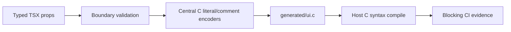

# Feature 0003 — generated C safety and compile gate

## Problem

Author-controlled labels and actions are interpolated into generated C. A malformed comment payload or raw control character can corrupt the artifact, hide a compiler error, or inject executable C.

## Proposed outcome

Make every generated C boundary explicit and adversary-safe, then compile a representative artifact with a host C compiler using warnings as errors before any board flash.

## Architecture

## Acceptance criteria

- [x] Text and label values encode quote, slash, newline, carriage return, tab, NUL and other C control characters safely.
- [x] Action values cannot terminate a generated comment or inject source; invalid action names fail with a path-aware diagnostic.
- [x] Generated C is compiled with the host C compiler using warnings as errors and a checked-in LVGL API stub.
- [x] Adversarial tests cover comment terminators and control characters.
- [x] CI uploads mutation evidence for the exact commit SHA and blocks on generated-C compilation.

## Test plan

Run `npm test`, the generated-C compile command and `npm run mutation` from a clean checkout. Keep physical-board and real-LVGL integration as later gates.
