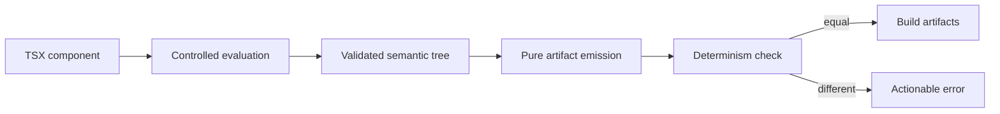

# Feature 0004 — deterministic compiler boundary

> Superseded by Feature 0010. Retained as historical evidence; deterministic
> runtime bundle evaluation now owns the active boundary.
> Its acceptance checklist is historical and is not an active release gate.

## Problem

The compiler executes an arbitrary component function. A component that reads time, randomness, environment or mutable state can produce different artifacts for the same source and configuration. The compiler can compare repeated evaluations within one invocation, but it cannot prove purity of an opaque JavaScript function across separate invocations.

## Proposed outcome

Make repeated component evaluation and deterministic artifact generation an explicit, testable boundary. Divergent roots must fail with a useful diagnostic instead of silently producing drift; cross-run reproducibility additionally requires pure roots and pinned tool/environment inputs.

## Architecture

## Acceptance criteria

- [x] The compiler documents the repeated-evaluation artifact contract and its purity limits.
- [x] A stateful or time-varying root fails deterministically with a path-aware diagnostic.
- [x] Pure roots continue to produce byte-identical artifacts.
- [x] The deterministic check does not weaken validation or allow malformed nodes.
- [ ] A controlled evaluator rejects stable environment/time/random reads across separate invocations.
- [x] Tests cover state, time and random-like variation without relying on timing races.

## Test plan

Use a controlled counter/random stub rather than wall-clock sleeps. Treat the current two-evaluation check as an intra-invocation guard; design a controlled evaluator before claiming static purity enforcement across separate invocations.
