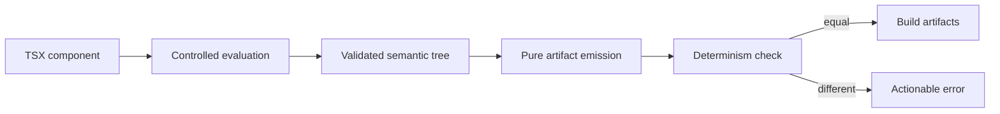

# Feature 0004 — deterministic compiler boundary

## Problem

The compiler executes an arbitrary component function. A component that reads time, randomness, environment or mutable state can produce different artifacts for the same source and configuration while the public contract promises deterministic output.

## Proposed outcome

Make component evaluation and deterministic artifact generation an explicit, testable boundary. Nondeterministic roots must fail with a useful diagnostic instead of silently producing drift.

## Architecture

## Acceptance criteria

- [x] The compiler documents the component purity/determinism contract.
- [x] A stateful or time-varying root fails deterministically with a path-aware diagnostic.
- [x] Pure roots continue to produce byte-identical artifacts.
- [x] The deterministic check does not weaken validation or allow malformed nodes.
- [x] Tests cover state, time and random-like variation without relying on timing races.

## Test plan

Use a controlled counter/random stub rather than wall-clock sleeps. Run host tests and mutation testing before moving the boundary into the full source compiler.
