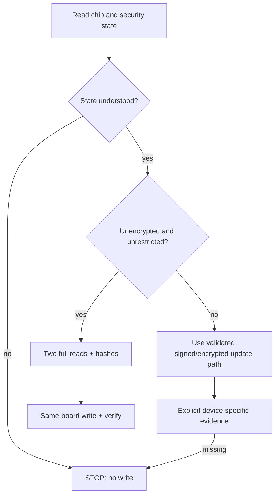

# Feature 0006 — recovery security-state matrix

## Problem

The generic full-flash dump/write recipe is safe only for a board whose security state permits those operations. Flash encryption, secure boot and secure download mode can change what is readable, writable and bootable.

## Proposed outcome

Make recovery a decision matrix with a hard stop for unknown or restricted security states, while preserving the verified same-device restore path for an explicitly confirmed unencrypted board.

## Architecture

## Acceptance criteria

- [x] Recovery docs distinguish unencrypted, flash-encrypted, secure-boot and secure-download states.
- [x] The generic raw dump/write commands are explicitly limited to confirmed unencrypted/unrestricted boards.
- [x] Restricted states have a hard stop and named evidence required before any write.
- [ ] Recovery tests record identity, security state, dump hashes and post-restore cold boot.
- [ ] No recovery command burns eFuses, erases first or uses `--force`.

## Test plan

Review the matrix against current Espressif esptool and ESP-IDF security documentation before board arrival; exercise only read-only identity commands until the exact board state is known.
