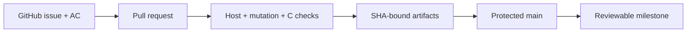

# Feature 0007 — repository governance and evidence

## Problem

Local hooks and templates document issue-first work but cannot enforce pull requests, protected `main`, immutable CI action references or SHA-bound evidence on GitHub.

## Proposed outcome

Make the repository server-side workflow match the documented contribution contract and preserve test artifacts for review.

## Architecture

## Acceptance criteria

- [ ] `main` requires a pull request and the required CI checks before merge.
- [x] CI actions are pinned to reviewed immutable commit SHAs.
- [x] Mutation reports are uploaded with the commit SHA.
- [x] The contribution docs state the protected-branch and evidence contract.

## Test plan

Verify branch protection through the GitHub API, inspect workflow YAML and confirm artifact names contain the commit SHA on a pull request run.

## Current platform constraint

The private repository's current GitHub plan rejects branch-protection configuration with HTTP 403 (`Upgrade to GitHub Pro or make this repository public`). Keep the local hook, issue/PR templates and pinned CI evidence active; re-run the server-side gate when the plan supports it without making the repository public.
