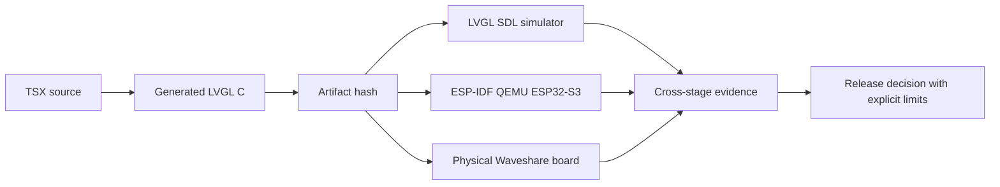

# Feature 0008 — emulator parity ladder

> Superseded by Feature 0010. Retained as historical evidence; the active
> ladder validates the runtime host and bundle rather than generated UI C.
> Its acceptance checklist is historical and is not an active release gate.

## Problem

Host tests and generated-C syntax checks are fast, but they do not exercise the ESP-IDF boot image, firmware memory map, UART behavior or ESP32-S3 peripheral integration. A physical board is slower and cannot cover every failure path.

## Proposed outcome

Test the exact generated UI artifact through a staged parity ladder: host compiler, native LVGL SDL, ESP32-S3 QEMU and finally the physical board. Each stage proves a different contract and records what it cannot prove.

## Architecture

## Acceptance criteria

- [ ] The same generated C and manifest are consumed by SDL, QEMU and the board application.
- [ ] QEMU boots the pinned ESP-IDF image and captures UART/monitor evidence without flashing hardware.
- [ ] QEMU framebuffer or other supported graphics evidence is compared with SDL for the supported surface.
- [ ] QEMU security/eFuse scenarios are used for reversible security workflow tests, never as proof of board-specific display/touch behavior.
- [ ] Physical smoke tests remain mandatory for panel, touch controller, timing, power and board-revision behavior.
- [ ] CI or a reproducible local command records tool versions, artifact hashes and the exact parity boundary.

## Test plan

Add the ESP-IDF/QEMU application only after the V1/V2 board revision gate. Keep emulator tests separate from hardware tests and mark unsupported peripherals as explicit gaps, not passes.
