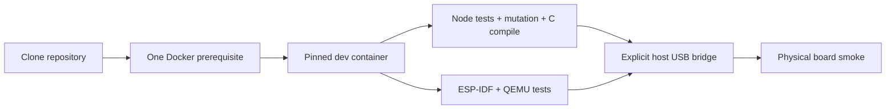

# Feature 0009 — one-command development environment

## Problem

ESP-IDF, QEMU, CMake/Ninja, cross-compilers, Python tools, Node and host test dependencies are a large and drift-prone installation surface. Contributors should not need to reproduce it manually on macOS.

## Proposed outcome

Provide one pinned container-based development environment. A contributor installs Docker Desktop once, clones the repository and runs documented commands; the repository owns the Node, ESP-IDF, QEMU and simulator tool versions. Physical USB flashing remains an explicit host bridge because Docker Desktop for Mac does not provide transparent USB passthrough.

## Architecture

## Acceptance criteria

- [ ] `.devcontainer` or an equivalent pinned container image contains Node, ESP-IDF, QEMU, CMake/Ninja, Python tools and simulator dependencies.
- [ ] `./tools/dev test`, `./tools/dev mutation`, `./tools/dev qemu` and `./tools/dev c-compile` work from a fresh clone after Docker Desktop installation.
- [ ] Tool versions and image digest are recorded; no implicit `latest` tag is used.
- [ ] Host-only development remains possible as an optional fast path, not a second source of truth.
- [ ] Physical flashing/serial access is documented as a separate, explicit host bridge with recovery safeguards.
- [ ] CI uses the same container definition or proves an equivalent pinned environment.

## Test plan

Build the container from scratch on Apple Silicon and x86_64, run the full host/mutation/C/QEMU ladder, and record the exact image digest. Do not claim USB or panel parity from the container alone.
