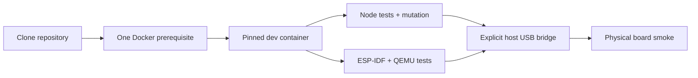

# Feature 0009 — one-command development environment

## Problem

ESP-IDF, QEMU, CMake/Ninja, cross-compilers, Python tools, Node and host test dependencies are a large and drift-prone installation surface. Contributors should not need to reproduce it manually on macOS.

## Proposed outcome

Provide one pinned container-based development environment. A contributor installs Docker Desktop once, clones the repository and runs documented commands; the repository owns the Node, ESP-IDF, QEMU and simulator tool versions. Physical USB flashing remains an explicit host bridge because Docker Desktop for Mac does not provide transparent USB passthrough.

## Architecture

## Acceptance criteria

- [x] `.devcontainer` or an equivalent pinned container image contains Node, ESP-IDF, QEMU, CMake/Ninja, Python tools and simulator dependencies.
- [x] `./tools/dev test` and `./tools/dev mutation` work from a fresh checkout after Docker Desktop installation.
- [ ] `./tools/dev qemu` is enabled and validated after the ESP-IDF application from issue #8 exists.
- [x] Tool versions and the built image ID are recorded; the base image uses an immutable digest and no implicit `latest` tag is used.
- [x] Host-only development remains possible as an optional fast path, not a second source of truth.
- [ ] Physical flashing/serial access is documented as a separate, explicit host bridge with recovery safeguards.
- [x] CI builds this exact container definition and runs the public `tools/dev` command path inside it.

## Test plan

The blocking container job starts from a fresh GitHub checkout, invokes `./tools/dev test` and `./tools/dev mutation` without host Node/ESP-IDF installation, and records the image ID, tool versions and command output. The QEMU command remains gated on issue #8; Apple Silicon build evidence and physical USB/display/touch gates remain open. Do not claim USB or panel parity from the container alone.
